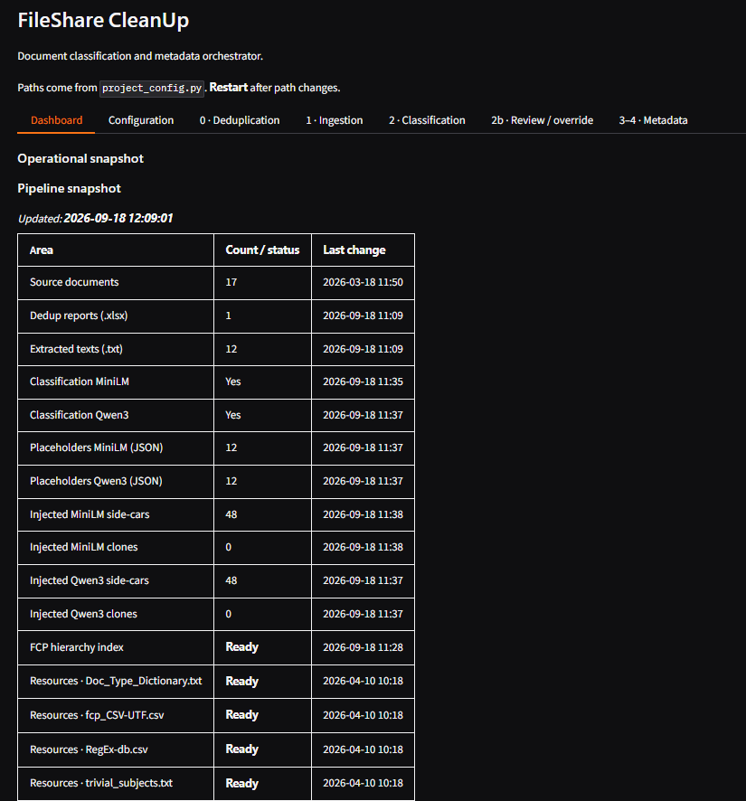
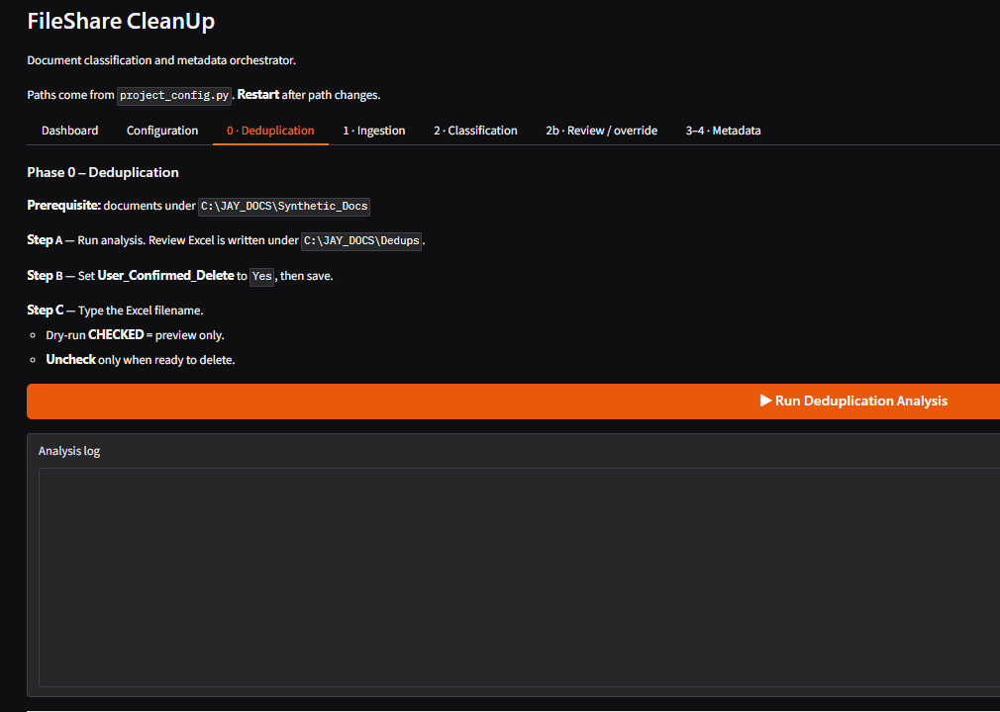
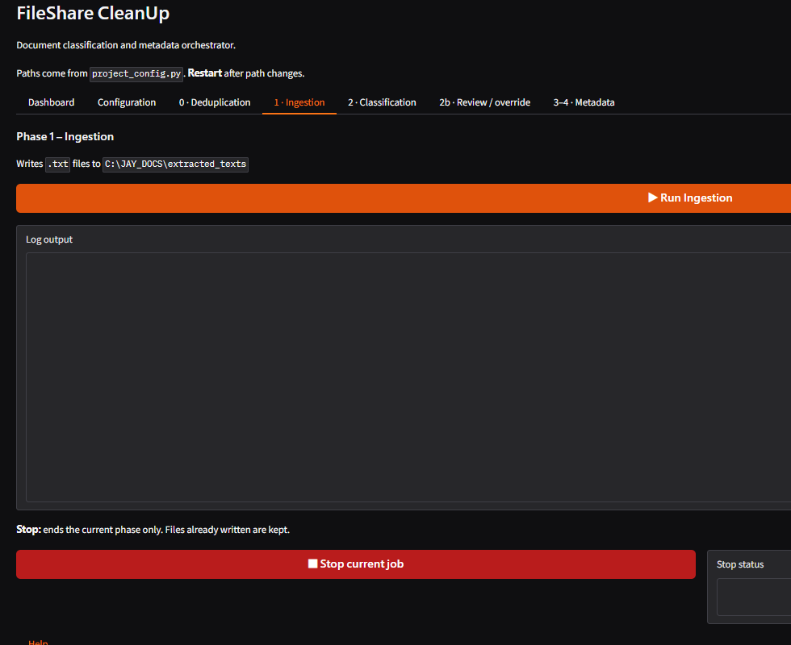
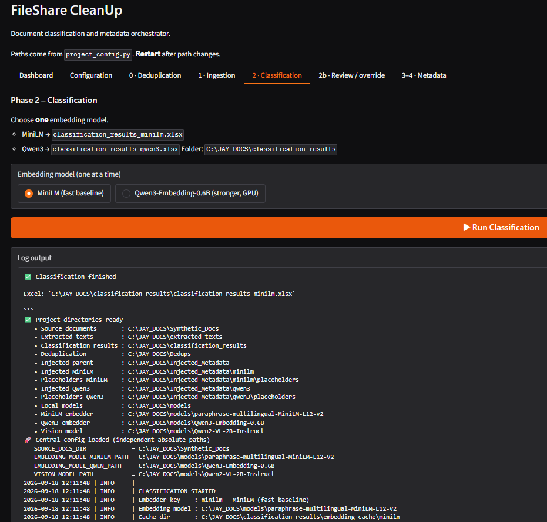
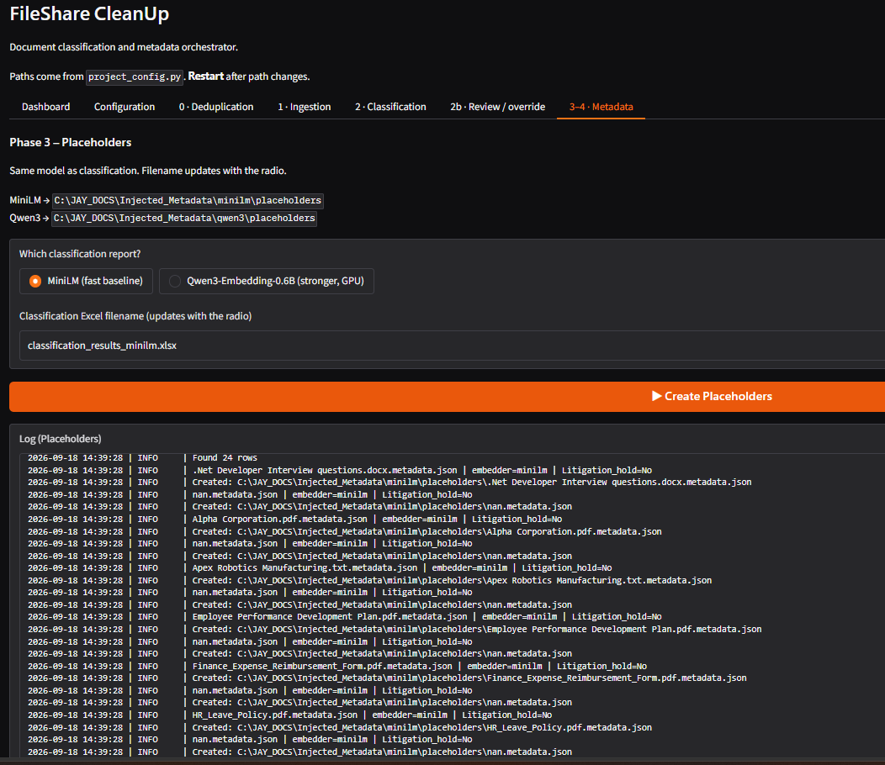
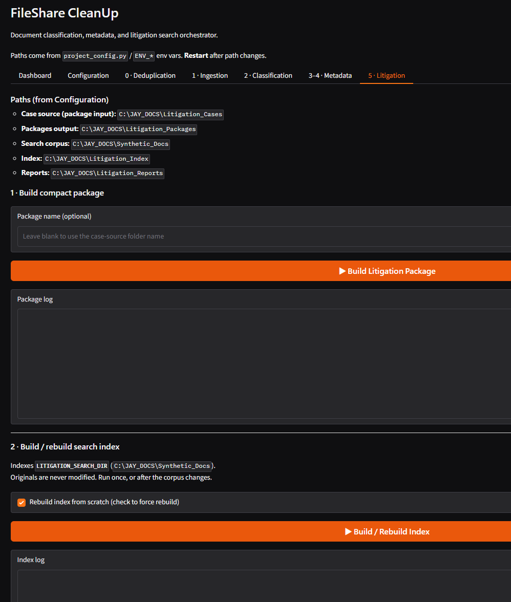

```markdown
# FileShare-GUI

Local Gradio application for **document deduplication, text extraction, semantic classification (FCP hierarchy), metadata injection, and litigation package / search**.

Designed to run **entirely on a single Windows workstation** (or similar), with **no required cloud services** at runtime. Hugging Face is used **only once** to download embedding and vision models to disk; after that the pipeline can run **offline**.

---

## What this application does

| Phase | Name | Purpose |
|-------|------|---------|
| 0 | **Deduplication** | Scan source documents for exact/near-duplicates and trivial content; produce an Excel review workbook; optional controlled delete |
| 1 | **Ingestion** | Extract text from PDF / Word / PowerPoint / images / text; export images for vision under `extracted_texts/_images` |
| 2 | **Classification** | Match document text to the FCP hierarchy (`fcp_CSV-UTF.csv`) using a local MiniLM embedding model; bilingual match excerpts; optional multi-image descriptions via local Qwen2-VL; enrich document type & sensitivity |
| 3 | **Placeholders** | Build JSON side-cars from `classification_results.xlsx` (including user edits to litigation/archival flags) |
| 4 | **Metadata injector** | Clone originals and inject metadata (native Office properties when possible; always JSON side-car) |
| 5 | **Litigation** | Build a condensed litigation package from court-case files; index a search corpus; hybrid search and Excel report |

A **Gradio** web UI orchestrates all phases (Dashboard, Configuration view, Stop control, per-phase logs).

---

## Design principles

- **Local-first / offline runtime** — no Ollama, no OCR cloud APIs, no required internet after model download  
- **Independent absolute paths** — source docs, extracts, results, models, and litigation folders can each live on different drives or DFS shares  
- **One config file** — set paths in `project_config.py` once per machine, then restart the app  
- **Human review** — classification and dedup produce Excel workbooks; selected columns (e.g. litigation hold) can be edited before placeholders/injection  
- **Managed-device friendly** — no admin install required if Python/conda is already available; distribute as a GitHub ZIP  

---

## Requirements

- **OS:** Windows recommended (Office metadata injection via `pywin32` is Windows-only). Core pipeline works on other OS without native Office inject.  
- **Python:** 3.10+ (3.11 tested in development)  
- **Optional:** Microsoft Office (licensed) for native Word/Excel property injection  
- **Disk:** space for models (embedder is small; Qwen2-VL-2B is larger) and document working folders  
- **GPU (optional):** helps vision; CPU works more slowly  

---

## Repository layout (high level)

```text
FileShare-GUI/
├── app.py                 # Gradio UI
├── project_config.py      # ALL absolute paths (edit on each machine)
├── requirements.txt
├── backend/               # runners, job control, dashboard status
├── Classification/
├── Ingestion/
├── DeDuplication/
├── Metadata_Placeholder/
├── Metadata_Injector/
├── Litigation/
└── Resources-Sources/     # fcp_CSV-UTF.csv, dictionaries, RegEx, etc.
```

**Not in Git (keep local):** virtualenv, model weight folders, live document corpora, classification outputs, indexes.

---

## 1. Get the code

### Option A — ZIP (recommended for end users)

1. Open the GitHub repo: `https://github.com/ssc-dsai/FileShare-GUI-python`  
2. **Code → Download ZIP**  
3. Extract to a **user-writable** folder, e.g.  
   `C:\Users\<you>\Apps\FileShare-GUI`  
   Do **not** install under `Program Files`.

### Option B — Git clone

```bash
git clone https://github.com/ssc-dsai/FileShare-GUI-python.git
cd FileShare-GUI-python
```

---

## 2. Create a Python environment

**venv:**

```bash
python -m venv .venv
.venv\Scripts\activate
python -m pip install --upgrade pip
python -m pip install -r requirements.txt
```

**or conda / miniconda:**

```bash
conda create -n FileShare-GUI python=3.11 -y
conda activate FileShare-GUI
python -m pip install -r requirements.txt
```

### spaCy language models (once per environment)

```bash
python -m spacy download en_core_web_sm
python -m spacy download fr_core_news_sm
```

### Windows only (native Office injection)

```bash
python -m pip install pywin32
```

If COM injection fails, the app still writes **`.metadata.json` side-cars**.

---

## 3. Download models from Hugging Face (one-time, needs network)

Runtime is offline; **first-time download requires internet**.

Create a models root (example):

```text
C:\FileShareData\models
```

### Embedding model (required for classification & litigation vectors)

`sentence-transformers/paraphrase-multilingual-MiniLM-L12-v2`

```bash
python -c "from sentence_transformers import SentenceTransformer; from pathlib import Path; local_dir = Path(r'C:\FileShareData\models\paraphrase-multilingual-MiniLM-L12-v2'); local_dir.mkdir(parents=True, exist_ok=True); print('Downloading to', local_dir); model = SentenceTransformer('sentence-transformers/paraphrase-multilingual-MiniLM-L12-v2'); model.save(str(local_dir)); print('Done')"
```

### Vision model (required for image-flagged documents)

`Qwen/Qwen2-VL-2B-Instruct`

Download with the same approach you used in development (Hugging Face `snapshot_download` / transformers save into):

```text
C:\FileShareData\models\Qwen2-VL-2B-Instruct
```

Point `project_config.py` at these folders (see below).

After download, you can set offline-friendly environment variables when starting the app (optional):

```text
HF_HUB_OFFLINE=1
TRANSFORMERS_OFFLINE=1
```

---

## 4. Configure paths (only place to set them)

Edit **`project_config.py`** on the machine. Set each absolute path to real folders on that PC or DFS share.

Typical entries:

| Setting | Meaning |
|---------|---------|
| `SOURCE_DOCS_DIR` | Incoming documents to process |
| `EXTRACTED_TEXTS_DIR` | Extracted `.txt` + `_images` |
| `CLASSIFICATION_RESULTS_DIR` | Excel/CSV + embedding cache |
| `DEDUPS_DIR` | Deduplication reports |
| `INJECTED_METADATA_DIR` | Clones + placeholders |
| `LITIGATION_*` | Case source, packages, search corpus, index, reports |
| `MODELS_DIR` / `EMBEDDING_MODEL_PATH` / `VISION_MODEL_PATH` | Local model folders |
| `RESOURCES` paths | `fcp_CSV-UTF.csv`, dictionaries, RegEx, trivial subjects |

**Rules:**

- Paths are **independent** (no single required data root).  
- **Restart** the Gradio app after any path change.  
- Do not put live data only inside the folder you overwrite when installing a new ZIP.

Ensure `Resources-Sources` files ship with the repo (FCP CSV, `Doc_Type_Dictionary.txt`, `RegEx-db.csv`, `trivial_subjects.txt`).

---

## 5. Start the application

```bash
cd <project-root>
.venv\Scripts\activate
python app.py
```

Open a browser:

```text
http://127.0.0.1:7860
```

- Use **Stop current job** to cancel a long phase (already-written files are kept; there is no undo).  
- **Dashboard** shows counts and readiness of key artifacts.

---

## 6. Typical end-to-end workflow

1. Place documents under `SOURCE_DOCS_DIR`.  
2. **Deduplication** → review Excel → optional delete (prefer dry-run first).  
3. **Ingestion** → `.txt` under extracted texts; images under `extracted_texts/_images`.  
4. **Classification** → `classification_results.xlsx`.  
5. Optional: edit Excel (`Litigation_hold`, `Archival_value`, `critical_business_content`, etc.).  
6. **Placeholders** → JSON side-cars (re-run after Excel edits).  
7. **Metadata injector** → clones + metadata.  
8. **Litigation** (separate from classification): package builder → index → search → report.

**Fixed classification metadata (not from FCP):**

- Disposition Authorization: `2021/005`  
- Technical Environment: `Microsoft's Distributed File System (DFS)`

---

## 7. Updating the application

1. Stop the app (Ctrl+C).  
2. Download a new ZIP (or `git pull`).  
3. Replace code files; **preserve** your edited `project_config.py` (or re-apply paths).  
4. Activate env → `pip install -r requirements.txt` if dependencies changed.  
5. Start again.

Data folders and model directories should live **outside** the code tree when possible.

---

## 8. Security notes (local deploy)

- Prefer **localhost** binding; do not use public Gradio share links for sensitive corpora.  
- Keep **model directories** writable only by trusted admins; load only models you downloaded.  
- Treat external PDFs/images as untrusted input (parser DoS possible); keep packages updated via `requirements.txt`.  
- Native Office injection is **best-effort**; JSON side-cars are the reliable metadata record.

---

## 9. Troubleshooting

| Symptom | Check |
|---------|--------|
| App won’t start | Correct venv/conda; `pip install -r requirements.txt` |
| Import / module errors | Run from project root; `PYTHONPATH` / working directory |
| Empty classification hierarchy | FCP CSV path; embedding model path; re-run classification |
| No `_images` for PDFs | Document may have no embedded rasters; standalone PNG/JPG are copied under `_images` when configured |
| Word inject fails | Office COM policy; side-car JSON still written |
| Hugging Face network calls | Models path wrong; set offline env vars; verify local folders |

---

## 10. License / ownership

Internal use under **ssc-dsai**. Adjust license and contact as required by your organization.

---

## Quick start (checklist)

- [ ] ZIP or clone into a user-writable folder  
- [ ] Create venv/conda env; install `requirements.txt`  
- [ ] Download MiniLM + Qwen2-VL into local model folders  
- [ ] Edit `project_config.py` paths once  
- [ ] `python app.py` → http://127.0.0.1:7860  
- [ ] Smoke-test Ingestion → Classification on a small folder  
```

## Configure paths (required)

Before the first run, open **`project_config.py`** and set every absolute
path for this machine (source documents, extracted texts, results, models,
litigation folders). Save the file and restart the app after any change.

# =============================================================================
# PATH CONFIGURATION (REQUIRED ON EACH MACHINE)
# =============================================================================
# Edit the absolute paths below to match this computer or DFS share.
# There is no single data root — each folder can live on a different drive.
# After changing any path, SAVE this file and RESTART the Gradio app
# (stop with Ctrl+C, then: python app.py).
# Do not rely on environment variables for normal use; this file is the
# single place to configure paths.
# =============================================================================

Paths are set only in project_config.py. Change paths there, save, then restart the application.


## User interface

### Dashboard


### Configuration of Absolute Paths


### Deduplication


### Ingestion of Raw Text from Documents


### Classification


### Metadata Placeholder and Injection


### Search Engine for Litigation Documents
